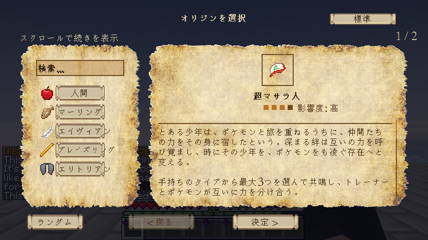
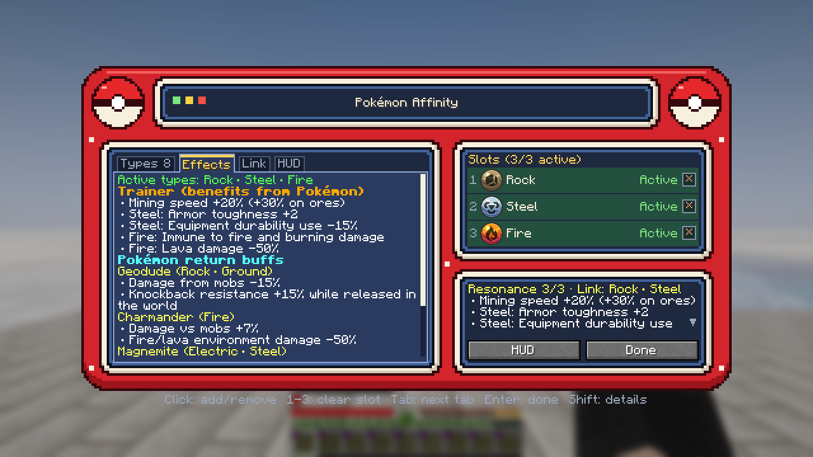
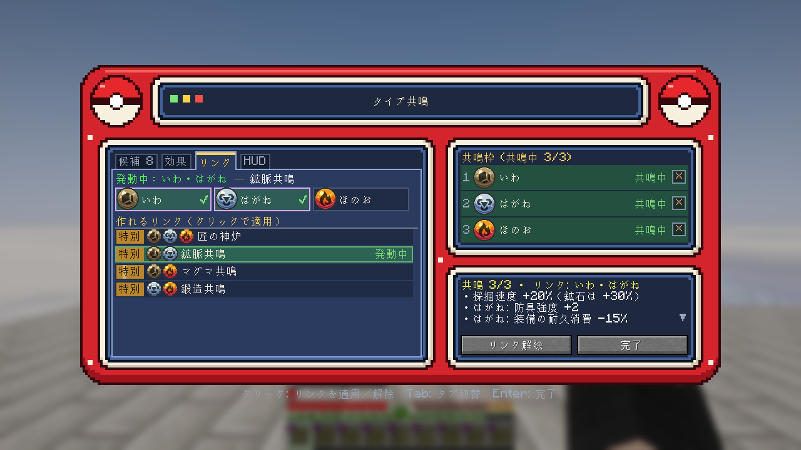
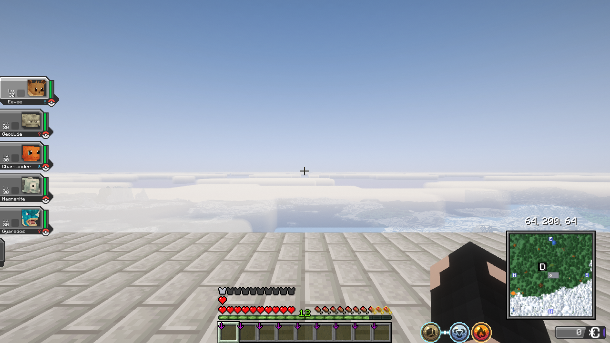

# 超マサラ人（Super Pallet Towner）

**Cobblemon 向けの NeoOrigins アドオンです。** NeoOrigins のビーストテイマー（Monster Tamer）を、Cobblemon の世界観に合わせたオリジン「超マサラ人」に置き換えます。能力はすぐに使えます。手持ちポケモンのタイプから最大3つを選ぶと、トレーナーとポケモンが互いに力を分け合います。

Minecraft 1.21.1 / NeoForge・バージョン 1.1.1・[English](README.md)

## 能力

| 能力 | 内容 |
|---|---|
| **タイプ共鳴** | 元気な手持ちポケモンのタイプから最大3つを選ぶ。移動速度・攻撃速度・採掘速度・防具・炎の無効化など、タイプごとの恩恵を受ける |
| **ポケモンへの返礼** | 選んだタイプを持つ手持ちポケモンにも効果が届く。主に Minecraft の Mob との戦闘が対象で、通常のポケモン同士のバトルには原則として影響しない |
| **共鳴リンクと重奏** | 選んだタイプのうち2つまたは3つをリンクすると、組み合わせの効果が発動する。名前付きのリンクが24種類あり、それ以外の組み合わせでも小さな標準効果がある |
| **トレーナーの素質** | 捕獲率 +3% |
| **仲間が倒れた時** | 手持ちが全員瀕死になると、安全なリスポーン地点へ帰還し、手持ちが回復する。手持ちが0匹のときは発動しない |

効果にはそれぞれ上限があり、他の MOD と組み合わせても強くなりすぎないようにしています。

## タイプ共鳴画面

操作設定で「タイプ共鳴を開く」にキーを割り当てて開きます。タイプの選択、効果の確認、リンクの設定ができます。

### 名前付きのリンク

| 2タイプ | リンク | 3タイプ | 重奏 |
|---|---|---|---|
| いわ＋はがね | 鉱脈共鳴 | ほのお＋いわ＋はがね | 匠の神炉 |
| ほのお＋はがね | 鍛造共鳴 | こおり＋いわ＋じめん | 絶対防壁 |
| ほのお＋いわ | マグマ共鳴 | ドラゴン＋ほのお＋ひこう | 紅蓮竜翔 |
| みず＋くさ | 生命水脈 | フェアリー＋くさ＋みず | 生命讃歌 |
| こおり＋みず | 凍土親水 | あく＋ゴースト＋エスパー | 深淵幻影 |
| むし＋くさ | 豊穣共鳴 | フェアリー＋ライト＋エスパー \* | 聖光重奏 |
| でんき＋はがね | 電磁誘導 | エア＋でんき＋ひこう \* | 天嵐駆動 |
| あく＋ゴースト | 深淵潜航 | でんき＋サウンド＋はがね \* | 共鳴機関 |
| ドラゴン＋かくとう | 覇王共鳴 | | |
| エスパー＋フェアリー | 霊光結界 | | |
| ノーマル＋かくとう | 練気共鳴 | | |
| エア＋ひこう \* | 噴流共鳴 | | |
| エア＋でんき \* | 雷雲共鳴 | | |
| フェアリー＋ライト \* | 光輝共鳴 | | |
| でんき＋サウンド \* | 増幅共鳴 | | |
| サウンド＋はがね \* | 響鋼共鳴 | | |

\* エア・ライト・サウンドは、他の Cobblemon 系 MOD が追加するタイプです。それらの MOD を入れている場合にだけ表示されます。

## アイコン

オリジンには専用のアイコン「トレーナーの紋章」（赤白の帽子をかぶったボール）を使っています。`/give @s super_pallet_towner:trainer_emblem` でアイテムとして入手することもできます。

## HUD

画面の隅の小さな HUD に、共鳴中のタイプとリンクが表示されます。位置と大きさは NeoOrigins の HUD 編集画面で変えられます。新しいタイプのポップイン、リンク発動時に広がるリング、リンクを流れる光などのアニメーションがあり、HUD 編集画面でオフにできます。

## 必要な MOD

クライアントとサーバーの両方に入れてください。

| MOD | 確認したバージョン |
|---|---|
| NeoForge（Minecraft 1.21.1） | 21.1.251 |
| Cobblemon | 1.8.1 |
| NeoOrigins | 2.2.29 |

## 導入

1. ワールドをバックアップします。
2. [Releases](https://github.com/ghasindusk/SuperPalletTowner-Standalone/releases) から `super_pallet_towner-1.1.1.jar` をダウンロードし、`mods` に入れます。
3. ゲームを起動し、オリジン選択画面で「超マサラ人」を選びます。ビーストテイマーを選んでいたプレイヤーは、自動で超マサラ人に移ります。
4. 操作設定で「タイプ共鳴を開く」にキーを割り当てます。

オリジンのデータは jar に入っているので、データパックは別に必要ありません。ビーストテイマーを置き換えるために NeoOrigins のメインのオリジン一覧を上書きしているため、同じ一覧を上書きする他のアドオンとは競合することがあります。

## 確認状況

- 自動テスト：162件すべて成功
- ゲーム内：オリジン選択画面、タイプ共鳴画面、HUD を確認済み
- 前提 MOD だけの環境（NeoForge、Cobblemon と Kotlin for Forge、NeoOrigins）でも、エラーなしで動作を確認
- 専用サーバーで動作確認済み（1.1.1 で、それ以前の版のサーバーでのクラッシュを修正）
- NeoOrigins のオリジン一覧を上書きする他のアドオンとの併用は未確認

不具合は [Issues](https://github.com/ghasindusk/SuperPalletTowner-Standalone/issues) へお願いします。

## ビルド

Java 21 が必要です。Cobblemon 1.8.1 と NeoOrigins 2.2.29 の jar を `libs/` に置き（コンパイル時のみ使い、同梱はしません）、`gradlew build` を実行します。

## ライセンス

MIT。非公式のファン制作物で、Cobblemon・NeoOrigins の開発者による承認は受けていません。これらの MOD の素材は含んでいません。詳しくは [THIRD_PARTY.md](THIRD_PARTY.md) を見てください。
